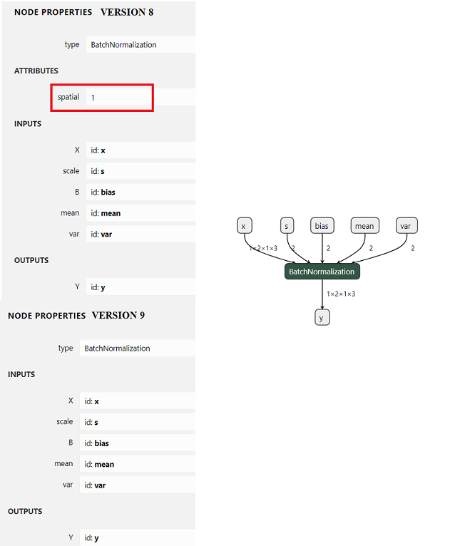

<!--- SPDX-License-Identifier: Apache-2.0 -->

## Version Conversion

The ONNX [Version Converter](https://github.com/onnx/onnx/blob/master/docs/VersionConverter.md) helps convert ONNX models to the version needed by the runtime you are using.

Version Conversion for BatchNormalization from opset 8 to 9:




### Downgrade Version Conversion from 9 to 8:

```python
import onnx

# Load the model
model = onnx.load("path_to/resnet18.onnx")

# Check that the IR is well formed
onnx.checker.check_model(model)

from onnx import version_converter

# Convert to version 8
converted_model = version_converter.convert_version(model, 8)

# Save model
onnx.save(converted_model, "path_to/resnet18_v8.onnx")
```

### Upgrade Version Conversion from 8 to 9

```python
# Convert to version 9
converted_model9 = version_converter.convert_version(converted_model, 9)

# Save model
onnx.save(converted_model9, "path_to/resnet18_v9.onnx")
```

### Downgrade Version Conversion from 8 to 7

```python
# Convert to version 7
converted_model7 = version_converter.convert_version(converted_model, 7)

# Save model
onnx.save(converted_model7, "path_to/resnet18_v7.onnx")
```

### Upgrade Version Conversion from 7 to 9

```python
# Convert to version 9
converted_model79 = version_converter.convert_version(converted_model7, 9)

# Save model
onnx.save(converted_model79, "path_to/resnet18_v79.onnx")
```
