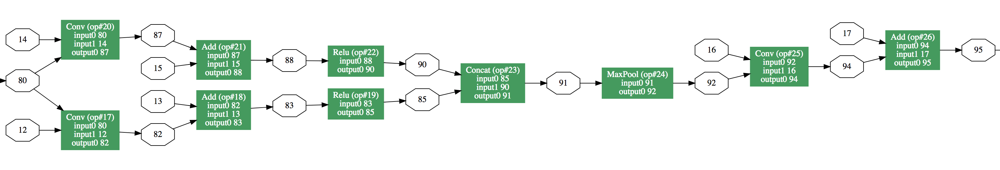

Visualizing an ONNX Model
=========================

To visualize an onnx model, we can use the [net drawer tool](https://github.com/onnx/onnx/blob/master/onnx/tools/net_drawer.py). This tool takes in a serialized ONNX model and produces a directed graph representation. The graph contains this information:

* Tensors
 * Input/output tensors
 * Intermediate tensors
* Ops
 * Op type
 * Op number
 * Input tensor names
 * Output tensor names
 * Docstrings (Pytorch exports stack traces here, so this is a good way to get your bearings about the network topology)

## SqueezeNet Example

Let's walk through an example visualizing a [SqueezeNet](https://arxiv.org/abs/1602.07360) model exported from [Pytorch](https://github.com/bwasti/AICamera/blob/master/Exporting%20Squeezenet%20to%20mobile.ipynb). An example visualization:

#### Prerequisites
* You will need [Graphviz](http://www.graphviz.org/), and particularly the `dot` command-line utility.
* You'll need the `pydot` Python package.
* For the net drawer, you will need [ONNX](https://github.com/onnx/onnx), both installed and cloned somewhere (so you have access to the net_drawer.py file).
* For the optional part (i.e. experimentation) you'll need Pytorch and Numpy

#### Convert an exported ONNX model to a Graphviz representation

In this folder you should find a file named `squeezenet.onnx`. This is a serialized SqueezeNet model that was exported to ONNX from Pytorch. Go into your ONNX repository and run the following command:

    python onnx/tools/net_drawer.py --input <path to squeezenet.onnx> --output squeezenet.dot --embed_docstring
    
The command line flags are as follows:

- `input` specifies the input filename, i.e. the serialized ONNX model you'd like to visualize
- `output` specifies where to write the Graphviz `.dot` file.
- `embed_docstring` specifies that you'd like to embed the doc_string for each node in the graph visualization. This is implemented as a javascript alert() that is fired when you click on the node.

Now, we have a Graphviz file `squeezenet.dot`. We need to convert it into a viewable format. Let's convert this into an `svg` file like so:

    dot -Tsvg squeezenet.dot -o squeezenet.svg
    
You should now have an `svg` file named `squeezenet.svg`. Now open this file in a web browser (I've tried Chrome and Firefox and they both work).

#### Interpreting the graph

Within the graph, white hexagons represent tensors and green rectangles represent ops. Within the op nodes, inputs are listed in order and outputs are listed in order. Note that the position of the Hexagons with respect to the ops does NOT represent input order. Finally, clicking on each op node will bring up an alert that contains the doc string (stack trace for Pytorch) that may have useful information about each node.

#### (Optional) Exporting the ONNX model

This is the code that I used to create the exported model. You can put this into a Python script if you'd like to experiment:

    # Some standard imports
    import io
    import numpy as np
    import torch.onnx
    
    import math
    import torch
    import torch.nn as nn
    import torch.nn.init as init
    import torch.utils.model_zoo as model_zoo
    
    
    __all__ = ['SqueezeNet', 'squeezenet1_0', 'squeezenet1_1']
    
    
    model_urls = {
        'squeezenet1_0': 'https://download.pytorch.org/models/squeezenet1_0-a815701f.pth',
        'squeezenet1_1': 'https://download.pytorch.org/models/squeezenet1_1-f364aa15.pth',
    }
    
    
    class Fire(nn.Module):
    
        def __init__(self, inplanes, squeeze_planes,
                     expand1x1_planes, expand3x3_planes):
            super(Fire, self).__init__()
            self.inplanes = inplanes
            self.squeeze = nn.Conv2d(inplanes, squeeze_planes, kernel_size=1)
            self.squeeze_activation = nn.ReLU(inplace=True)
            self.expand1x1 = nn.Conv2d(squeeze_planes, expand1x1_planes,
                                       kernel_size=1)
            self.expand1x1_activation = nn.ReLU(inplace=True)
            self.expand3x3 = nn.Conv2d(squeeze_planes, expand3x3_planes,
                                       kernel_size=3, padding=1)
            self.expand3x3_activation = nn.ReLU(inplace=True)
    
        def forward(self, x):
            x = self.squeeze_activation(self.squeeze(x))
            return torch.cat([
                self.expand1x1_activation(self.expand1x1(x)),
                self.expand3x3_activation(self.expand3x3(x))
            ], 1)
    
    
    class SqueezeNet(nn.Module):
    
        def __init__(self, version=1.0, num_classes=1000):
            super(SqueezeNet, self).__init__()
            if version not in [1.0, 1.1]:
                raise ValueError("Unsupported SqueezeNet version {version}:"
                                 "1.0 or 1.1 expected".format(version=version))
            self.num_classes = num_classes
            if version == 1.0:
                self.features = nn.Sequential(
                    nn.Conv2d(3, 96, kernel_size=7, stride=2),
                    nn.ReLU(inplace=True),
                    nn.MaxPool2d(kernel_size=3, stride=2, ceil_mode=False),
                    Fire(96, 16, 64, 64),
                    Fire(128, 16, 64, 64),
                    Fire(128, 32, 128, 128),
                    nn.MaxPool2d(kernel_size=3, stride=2, ceil_mode=False),
                    Fire(256, 32, 128, 128),
                    Fire(256, 48, 192, 192),
                    Fire(384, 48, 192, 192),
                    Fire(384, 64, 256, 256),
                    nn.MaxPool2d(kernel_size=3, stride=2, ceil_mode=False),
                    Fire(512, 64, 256, 256),
                )
            else:
                self.features = nn.Sequential(
                    nn.Conv2d(3, 64, kernel_size=3, stride=2),
                    nn.ReLU(inplace=True),
                    nn.MaxPool2d(kernel_size=3, stride=2, ceil_mode=False),
                    Fire(64, 16, 64, 64),
                    Fire(128, 16, 64, 64),
                    nn.MaxPool2d(kernel_size=3, stride=2, ceil_mode=False),
                    Fire(128, 32, 128, 128),
                    Fire(256, 32, 128, 128),
                    nn.MaxPool2d(kernel_size=3, stride=2, ceil_mode=False),
                    Fire(256, 48, 192, 192),
                    Fire(384, 48, 192, 192),
                    Fire(384, 64, 256, 256),
                    Fire(512, 64, 256, 256),
                )
            # Final convolution is initialized differently form the rest
            final_conv = nn.Conv2d(512, self.num_classes, kernel_size=1)
            self.classifier = nn.Sequential(
                nn.Dropout(p=0.5),
                final_conv,
                nn.ReLU(inplace=True),
                nn.AvgPool2d(13)
            )
    
            for m in self.modules():
                if isinstance(m, nn.Conv2d):
                    if m is final_conv:
                        init.normal(m.weight.data, mean=0.0, std=0.01)
                    else:
                        init.kaiming_uniform(m.weight.data)
                    if m.bias is not None:
                        m.bias.data.zero_()
    
        def forward(self, x):
            x = self.features(x)
            x = self.classifier(x)
            return x.view(x.size(0), self.num_classes)
    
    
    def squeezenet1_0(pretrained=False, **kwargs):
        r"""SqueezeNet model architecture from the `"SqueezeNet: AlexNet-level
        accuracy with 50x fewer parameters and <0.5MB model size"
        <https://arxiv.org/abs/1602.07360>`_ paper.
        Args:
            pretrained (bool): If True, returns a model pre-trained on ImageNet
        """
        model = SqueezeNet(version=1.0, **kwargs)
        if pretrained:
            model.load_state_dict(model_zoo.load_url(model_urls['squeezenet1_0']))
        return model
    
    
    def squeezenet1_1(pretrained=False, **kwargs):
        r"""SqueezeNet 1.1 model from the `official SqueezeNet repo
        <https://github.com/DeepScale/SqueezeNet/tree/master/SqueezeNet_v1.1>`_.
        SqueezeNet 1.1 has 2.4x less computation and slightly fewer parameters
        than SqueezeNet 1.0, without sacrificing accuracy.
        Args:
            pretrained (bool): If True, returns a model pre-trained on ImageNet
        """
        model = SqueezeNet(version=1.1, **kwargs)
        if pretrained:
            model.load_state_dict(model_zoo.load_url(model_urls['squeezenet1_1']))
        return model
    
    torch_model = squeezenet1_1(True)
    
    from torch.autograd import Variable
    batch_size = 1    # just a random number
    
    # Input to the model
    x = Variable(torch.randn(batch_size, 3, 224, 224), requires_grad=True)
    
    # Export the model
    torch_out = torch.onnx._export(torch_model,             # model being run
                                   x,                       # model input (or a tuple for multiple inputs)
                                   "squeezenet.onnx",       # where to save the model (can be a file or file-like object)
                                   export_params=True)      # store the trained parameter weights inside the model file